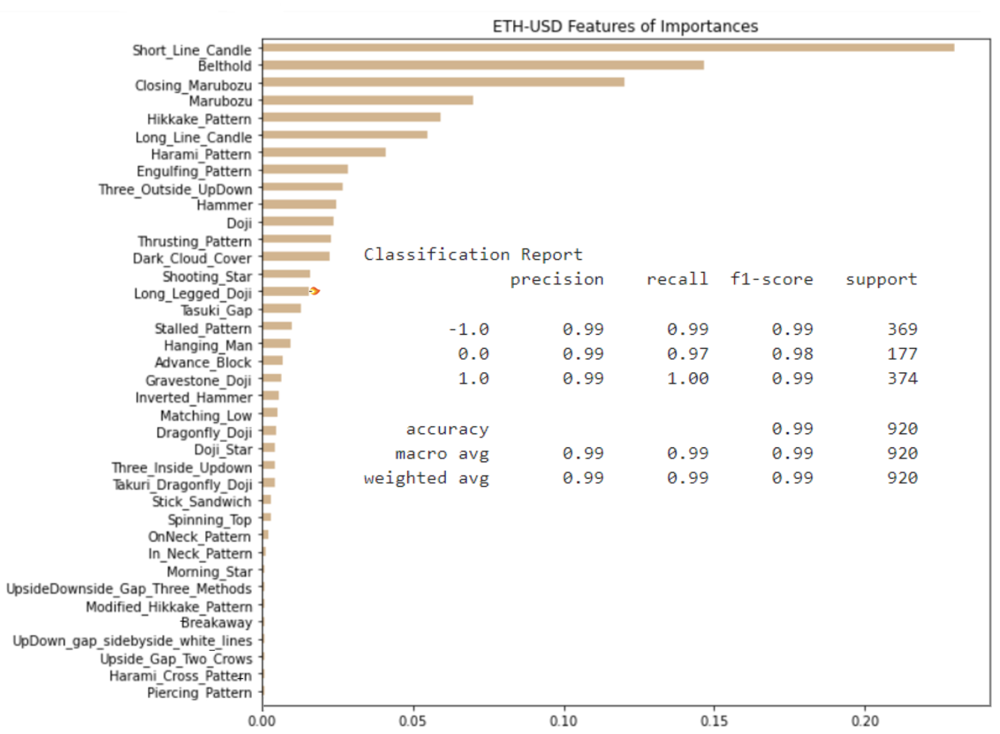
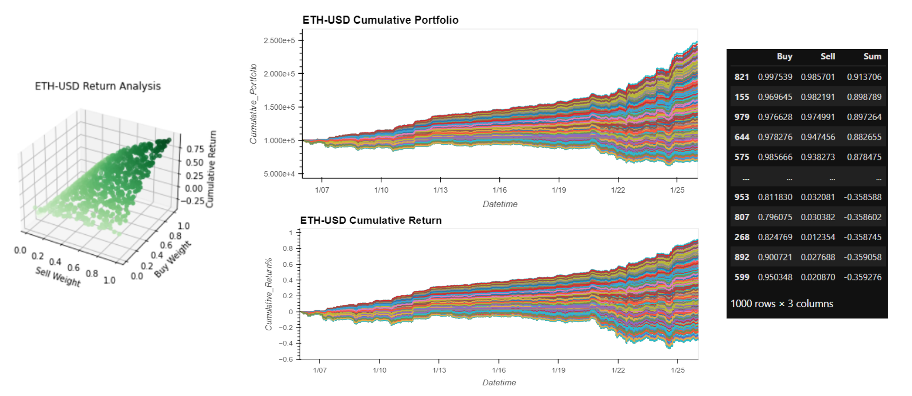
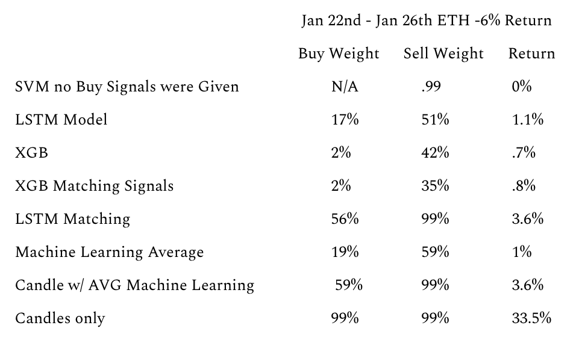

# Candlestick Predictions
-----
## Core Hypothesis
- Can machine learning increase the returns resulting from the implementation of a candlestick charting trading strategy? 
- Is there a Machine Learning model that can produce positive returns?
- Can our position be optimized for the best returns possible?
- Which Machine Learning method would produce the best results?
- What division of assets provides us with the best overall results?
-----
## Data Utilized
- Historical Eterium Prices from January 6th 2022 to January 26th
    - 5 minute intervals
- Dataframe of 6,000 entries
- Over 60 Candlestick functions to generate buy or sell signals

-----
## Models Utilized
- Random Forest
- Monte Carlo Simulations
- LSTM Neural Networks
- SVM Models
- eXtreme Gradient Booster
-----
## Training Process

- LSTM Neural Networks
    - Training and Testing the model:
        - Window = 25
        - 80% train/test split
        - Epochs = 100
        - Batch size = 96
        - Loss = 0.0022
- SVM Models
    - Treat the price prediction as a classification problem
    - Accept multiple inputs: Open, High, Low, Close (Unlike just one input with LSTM)
    - Provides a single output: Signal = Price Increase or Price Decrease (ie. trade Long or Short)
- XGBoost
    - Linear Regression Model 
    - Time Series Analysis
        - Trained prediction models on Microsoft closing prices
        - Adjusted common parameters until the RMSE and R2 scores were favorable for a prediction method
        - Switched to Etherium data
-----

## Evaluation Techniques
- Random Forest  
    - Running a random forest the candlesticks were able to return at 99% accuracy and recall when predicting precision. 
    - With so many indicators they rarely overlapped or contradict one another.
    - The top three features of importance were the Short Line Candle, Belt Hold, and Closing Marubozu.

         

- Monte Carlo Simulations  
    - Using a Monte Carlo Simulation we ran the positional signals 1000 times changing the weights of what it would buy and sell each time.
Parameters:
The model could not buy more shares then funds that were available.
The buy and sell weights were restricted between 1 and 0.

         
- LSTM Neural Networks
    - Feeding the model new data:
    - Same parameters  
    - Data = 1/27/2022 - 1/28/2022
    - Loss: 0.0014

- SVM Models Results • Support Vector Machine  
    - Precision & Recall: Poor, lots of false positives and false negatives:  .99 and .95
    - Accuracy: .59, not great, slightly better than a coin toss  
    - AUC (Area Under Curve): 56%, Not great, only slightly better than a coin toss 
- XGBoost
    - Linear Regression
        - RMSE Scores
        - R2 Scores
    - Time Series Analysis
        - RMSE Scores
        - MAE Scores
-----

## Conclusions and Predictions
### Conclusions
- All Machine Learning algorithms performed better than the market
- Highest Machine Learning return was the LSTM Matching at 3.6%
- Highest overall return was candlestick signals, with 33.5% returns
 

## Moving Forward
- 300 year old methods can still perform effectively in a highly volatile market of cryptocurrency
- Adding in Machine Learning models can assit and improve returns even in a downward trending market!